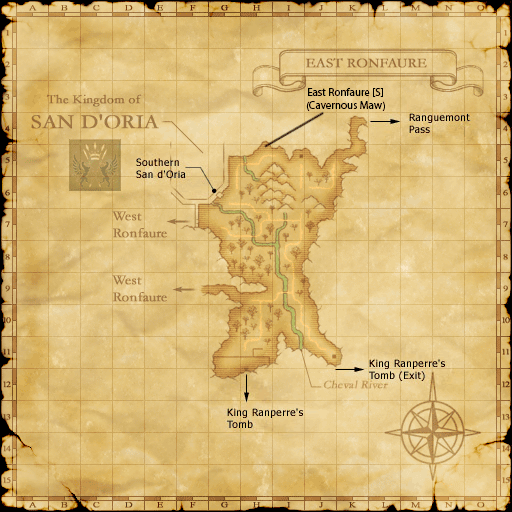

# FFXI Map DATS

A collection of modified DAT files for FFXI that show additional details on the in-game maps, including:

* Zone exits/entrances
* Unmapped areas
* Blocked paths
* NM spawn locations
* Quest locations

**Note: This is a work in progress. More zones will become available as time goes by.**

## Example

## Source

These maps are basically pulled from BG Wiki. The original intentions was to remove most of the details such as NM pop locations and quest/mission-specific locations to keep the map as clear as possible, but this will happen if future users feel the maps are too noisy.

## Pre installation

Before you install anything, make a backup of your DAT files. Do this by taking a copy of the following directories:

* ...\FINAL FANTASY XI\ROM\17
* More will follow as more maps are created

## Installation

Copy all files to the FINAL FANTASY XI directory and choose to overwrite.
