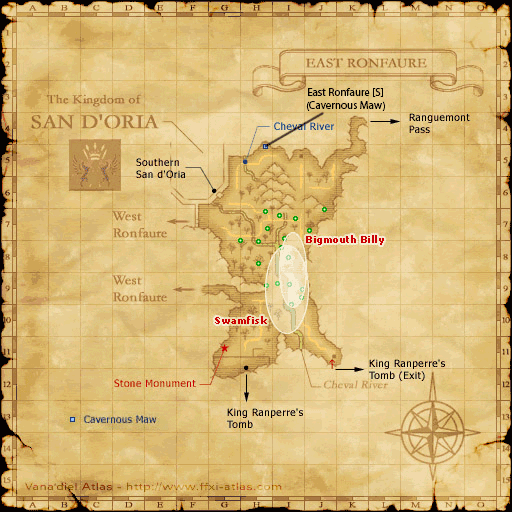

# FFXI Map DATS

A collection of modified DAT files for FFXI that show additional details on the in-game maps, including:

* Zone exits/entrances
* Unmapped areas
* Blocked paths
* NM spawn locations
* Quest locations

**Note: This is a work in progress. More zones will become available as time goes by.**

## Example

## The List

A list of covered zones is available in the [ZONES](ZONES.md) file. If you see a map that is not covered yet, I can prioritise it if you [raise an issue](https://github.com/xurion/ffxi-map-dats/issues) 😄

## Source

These maps are pulled from, and credit goes to, [BG Wiki](https://www.bg-wiki.com/bg/Main_Page). The original intention was to remove most of the details such as NM pop locations and quest/mission-specific locations to keep the map as clear as possible, but this will happen if future users feel the maps are too noisy. To begin with, I think these are helpful enough.

## Pre installation

Before you install anything, make a backup of your DAT files. Do this by taking a copy of the following directories:

* ...\FINAL FANTASY XI\ROM\17

**Note: More will follow as more maps are covered**

## Installation

Copy all files to the FINAL FANTASY XI directory and choose to overwrite/replace.

## Legal
* All trademarks or registered trademarks are the property of their respective owners.
* All images of FINAL FANTASY XI content or assets are (c) 2002-2018 SQUARE ENIX CO., LTD. All Rights Reserved.
* FINAL FANTASY, SQUARE ENIX, and the SQUARE ENIX logo are registered trademarks of Square Enix Holdings Co., Ltd. Vana’diel, Tetra Master, PLAYONLINE, the PLAYONLINE logo, Rise of the Zilart, Chains of Promathia, Treasures of Aht Urhgan, Wings of the Goddess, and Seekers of Adoulin are registered trademarks of Square Enix Co., Ltd.
* FINAL FANTASY is a registered trademark of Square Enix Holdings Co., Ltd.
* FINAL FANTASY XI © 2002 - 2020 SQUARE ENIX CO., LTD. All Rights Reserved.
